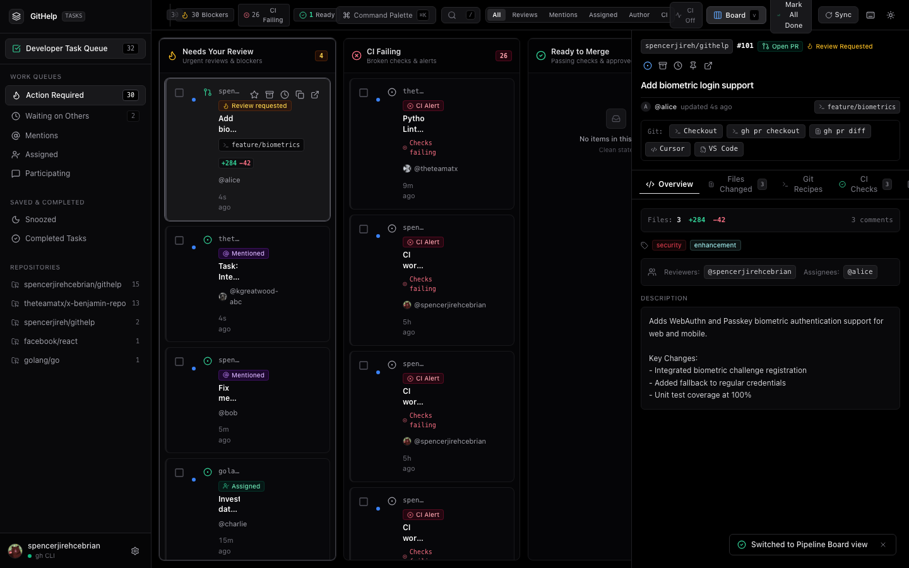

# GitHelp

Local-first, keyboard-driven Git & PR Developer Task Workstation and workflow execution center.


GitHelp bridges remote GitHub activity with your local terminal and IDE. It transforms passive notification triage into an active **Developer Task Command Center** organized into actionable sections: **Today's Focus**, **PRs Needing Your Review**, **Your Authored PRs**, and **Assigned Issues**, equipped with an interactive **PR inspection cockpit**, one-click **Git checkout runners**, and a spotlight **Command Palette (`Cmd+K`)**.

---

## Features & Workstation Layout

- **Developer Task Execution Architecture**:
  - **Today's Focus Queue (`t`)**: Pin 2–4 priority tasks you plan to tackle today with a real-time burndown progress pill (`Today: 2/4 Done`).
  - **Collapsible Task Sections**: Grouped into *Today's Focus*, *PRs Needing Your Review*, *Your Authored PRs*, *Assigned Issues & Tasks*, and *Completed Today*.
  - **1-Click Checkbox Completion (`Space` / `e`)**: Complete tasks immediately with tactile checkmark feedback and automatic archiving.
- **Dual View Modes (`v`)**:
  - **Task Sections View**: High-density, scan-optimized task queue with inline diff metrics (`+284 -42`), branch tags, and vim-style `j`/`k` navigation.
  - **Pipeline Board View**: 4-column visual kanban (*Needs Your Review*, *CI Failing*, *Ready to Merge*, *Waiting on Others*) with full 2D keyboard navigation (`h`/`l`/arrows for columns, `j`/`k` for items).
- **Clean CI by Default**: Passing CI badges are hidden by default to eliminate noise, with a global toggle button in the top bar to reveal status badges on demand.
- **Deep Inspection Cockpit**: Deep PR overview, file changes with line diffs, CI diagnostics, and private review notes, accessible in both Task and Board modes.
- **One-Click Git Actions**: Immediately checkout branches (`git checkout <branch>` / `gh pr checkout <num>`), copy PR diffs, or open repositories in Cursor/VS Code.
- **Global Command Palette (`Cmd+K` / `Ctrl+K`)**: Fast spotlight launcher for search, task completion, focus pinning, and navigation.
- **Zero-Config Auth**: Automatically uses existing `gh` CLI credentials (or configured PAT).

| Pipeline Board | Diff Inspector |
| :---: | :---: |
|  |  |

| Command Palette | Snooze Modal |
| :---: | :---: |
|  |  |

---

## Quick Start

### Build and Run Standalone
```bash
make run
```
Open **http://127.0.0.1:8080**.

### Development Mode
```bash
make dev
```
- Frontend: `http://localhost:5173` (Vite HMR)
- Backend: `http://127.0.0.1:8080`

---

## Keyboard Shortcuts

| Key | Action |
| :--- | :--- |
| `Space` / `e` | Complete Task (Mark Done) |
| `t` | Pin / Toggle item in Today's Focus |
| `Cmd+K` / `Ctrl+K` | Open Command Palette |
| `v` | Toggle Task Sections / Pipeline Board View |
| `h` / `l` / `←` / `→` | Switch Pipeline Board Columns (in Board mode) |
| `j` / `k` / `↓` / `↑` | Navigate items in task list or column |
| `o` / `Enter` | Open in browser / GitHub |
| `z` | Snooze (`1`: 1h, `2`: 3h, `3`: tomorrow, `4`: next Monday) |
| `c` | Copy `git checkout <branch>` or URL |
| `u` | Toggle Read / Unread |
| `p` | Pin / Unpin item |
| `/` | Focus search bar |
| `r` | Sync tasks with GitHub |
| `?` | Keyboard shortcuts reference cheat sheet |
| `Esc` | Close modal / command palette / clear search |

---

## Build & Test

### Make
```bash
make run            # Build and launch standalone binary
make build          # Build standalone binary (./bin/githelp)
make test           # Run backend, frontend (Vitest), and Playwright E2E tests
make lint           # Go vet & TypeScript check
```

### Bazel
```bash
./bazel build //... # Hermetic workspace build
./bazel test //...  # Run all test targets
./bazel run //:githelp # Build and launch server
```

---

## Architecture

- **Backend**: Go (`net/http`, pure Go `modernc.org/sqlite` with WAL mode).
- **Frontend**: React 19, TypeScript, Tailwind CSS, Lucide icons.
- **Distribution**: Single executable with embedded assets (`//go:embed all:dist`).

---

## License

[MIT](LICENSE)
