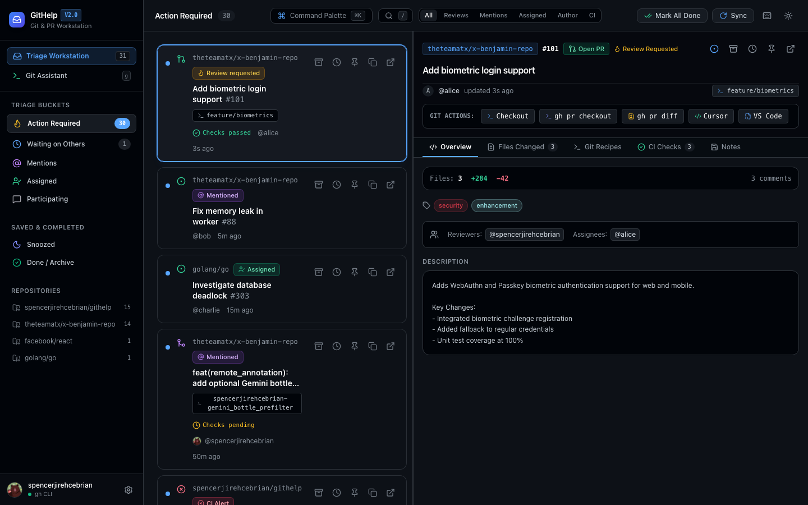
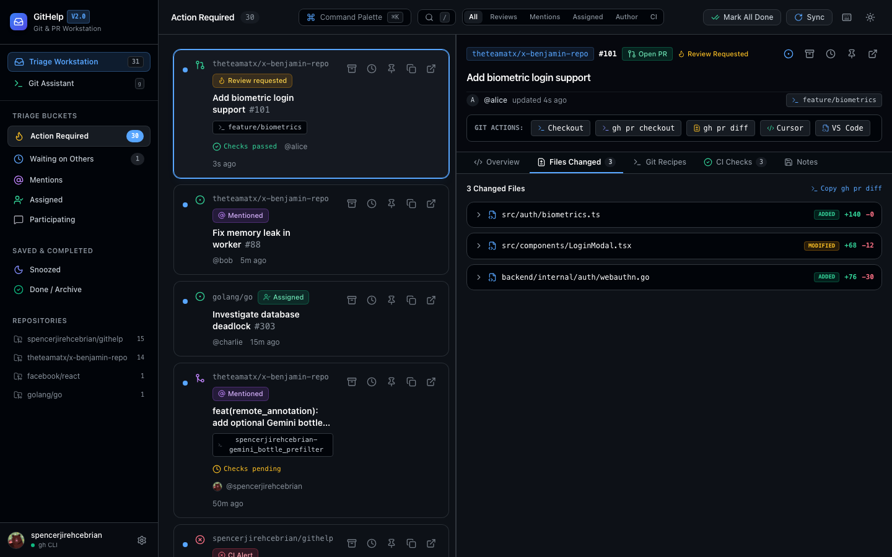
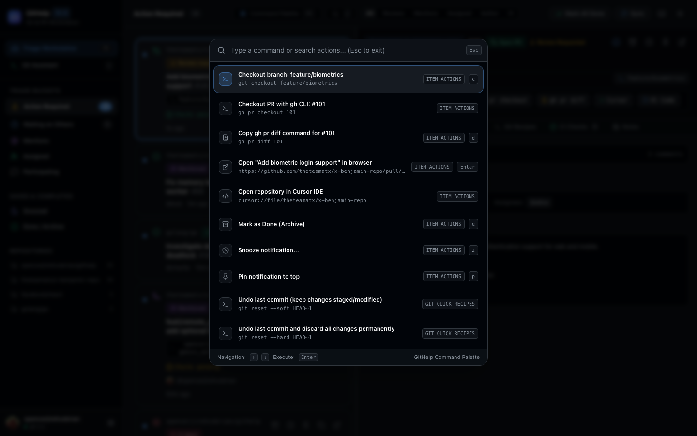
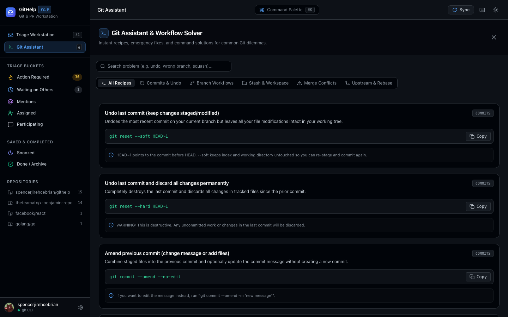
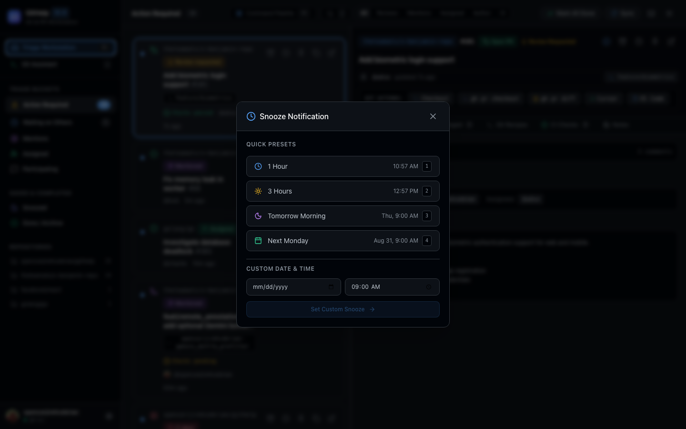

# GitHelp

Local-first, keyboard-driven Git & PR developer workstation and workflow launcher.



GitHelp bridges remote GitHub notifications with your local terminal and IDE. It transforms passive notification triage into an active **3-pane Git & PR workstation** equipped with an interactive **PR inspection cockpit**, one-click **Git & GitHub CLI action runners**, an emergency **Git workflow solver**, and a spotlight **Command Palette (`Cmd+K`)**.

---

## Features & Workstation Layout

- **3-Pane Workstation Architecture**:
  - **Left Rail (Navigation & Repos)**: Quick-switch between Triage Workstation and Git Assistant, filter by repository, and inspect connected accounts.
  - **Middle Column (Work Stream)**: High-density, scan-optimized feed with CI status badges, branch tags, and vim-style `j`/`k` navigation.
  - **Right Cockpit (Git & PR Inspection)**: Deep PR overview, file changes with line diffs (`+284 -42`), CI diagnostics, and private review notes.
- **One-Click Git Actions**: Immediately checkout branches (`git checkout <branch>` / `gh pr checkout <num>`), copy PR diffs, open repositories in Cursor/VS Code, or approve PRs.
- **Global Command Palette (`Cmd+K` / `Ctrl+K`)**: Fast spotlight launcher for search, triage actions, Git recipes, and navigation.
- **Built-in Git Assistant (`g`)**: Comprehensive emergency and scenario solver for common Git dilemmas (undo commits, branch cleanup, merge conflicts, interactive rebasing).
- **Linear-Style Triage**: Automatically categorizes items into **Action Required**, **Waiting on Others**, **Mentions**, **Assigned**, **Participating**, **Snoozed**, and **Done**.
- **Zero-Config Auth**: Automatically uses existing `gh` CLI credentials (or configured PAT).

| Diff Inspector | Command Palette |
| :---: | :---: |
|  |  |

| Git Assistant & Solver | Snooze Triage |
| :---: | :---: |
|  |  |

---

## Quick Start

### Build and Run Standalone
```bash
make run
```
Open **http://127.0.0.1:8080**.

### Development Mode
```bash
make dev
```
- Frontend: `http://localhost:5173` (Vite HMR)
- Backend: `http://127.0.0.1:8080`

---

## Keyboard Shortcuts

| Key | Action |
| :--- | :--- |
| `Cmd+K` / `Ctrl+K` | Open Command Palette |
| `g` | Toggle Git Assistant & Workflow Solver |
| `j` / `k` | Navigate items down / up in work stream |
| `o` / `Enter` | Open in browser / GitHub |
| `e` | Mark as Done (Archive) |
| `z` | Snooze (`1`: 1h, `2`: 3h, `3`: tomorrow, `4`: next Monday) |
| `c` | Copy `git checkout <branch>` or URL |
| `u` | Toggle Read / Unread |
| `p` | Pin / Unpin item to top |
| `/` | Focus search bar |
| `r` | Sync notifications with GitHub |
| `?` | Keyboard shortcuts reference cheat sheet |
| `Esc` | Close modal / command palette / clear search |

---

## Build & Test

### Make
```bash
make run            # Build and launch standalone binary
make build          # Build standalone binary (./bin/githelp)
make test           # Run backend, frontend (Vitest), and Playwright E2E tests
make lint           # Go vet & TypeScript check
```

### Bazel
```bash
./bazel build //... # Hermetic workspace build
./bazel test //...  # Run all test targets
./bazel run //:githelp # Build and launch server
```

---

## Architecture

- **Backend**: Go (`net/http`, pure Go `modernc.org/sqlite` with WAL mode).
- **Frontend**: React 19, TypeScript, Tailwind CSS, Lucide icons.
- **Distribution**: Single executable with embedded assets (`//go:embed all:dist`).

---

## License

[MIT](LICENSE)
