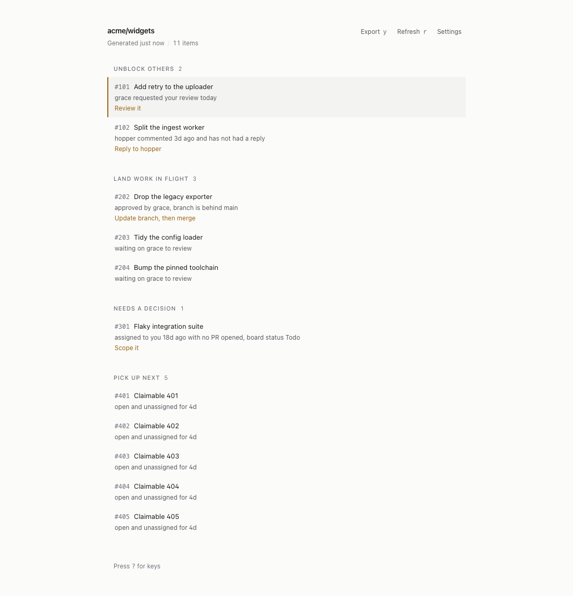
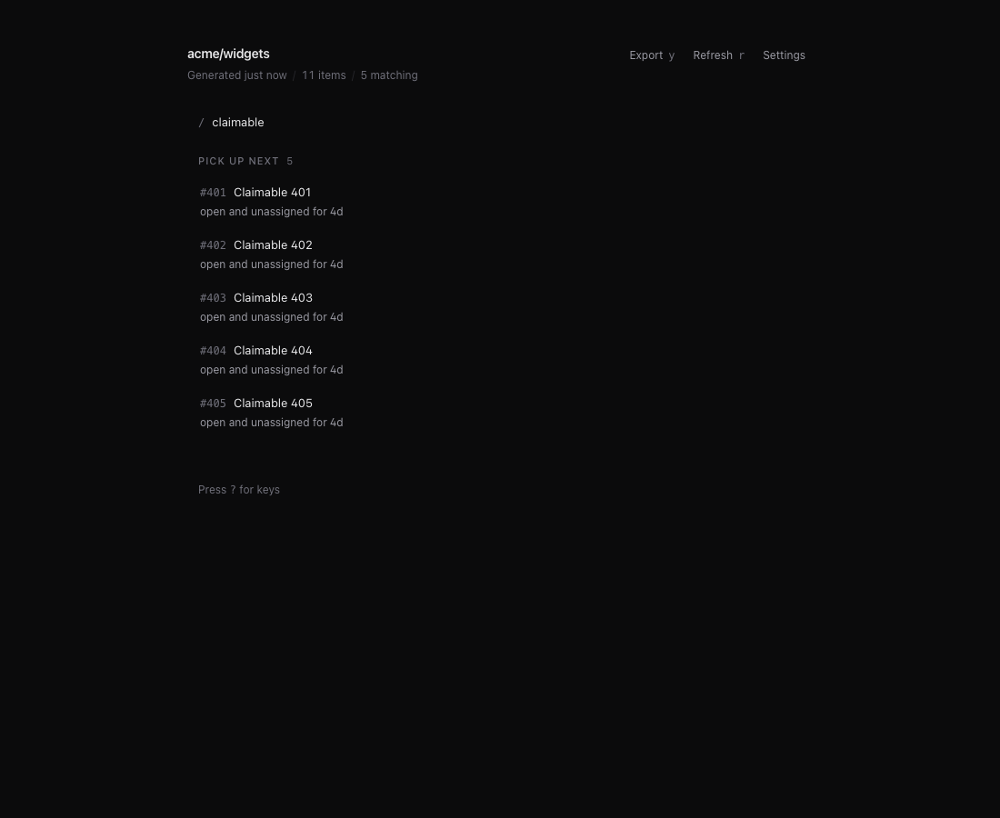
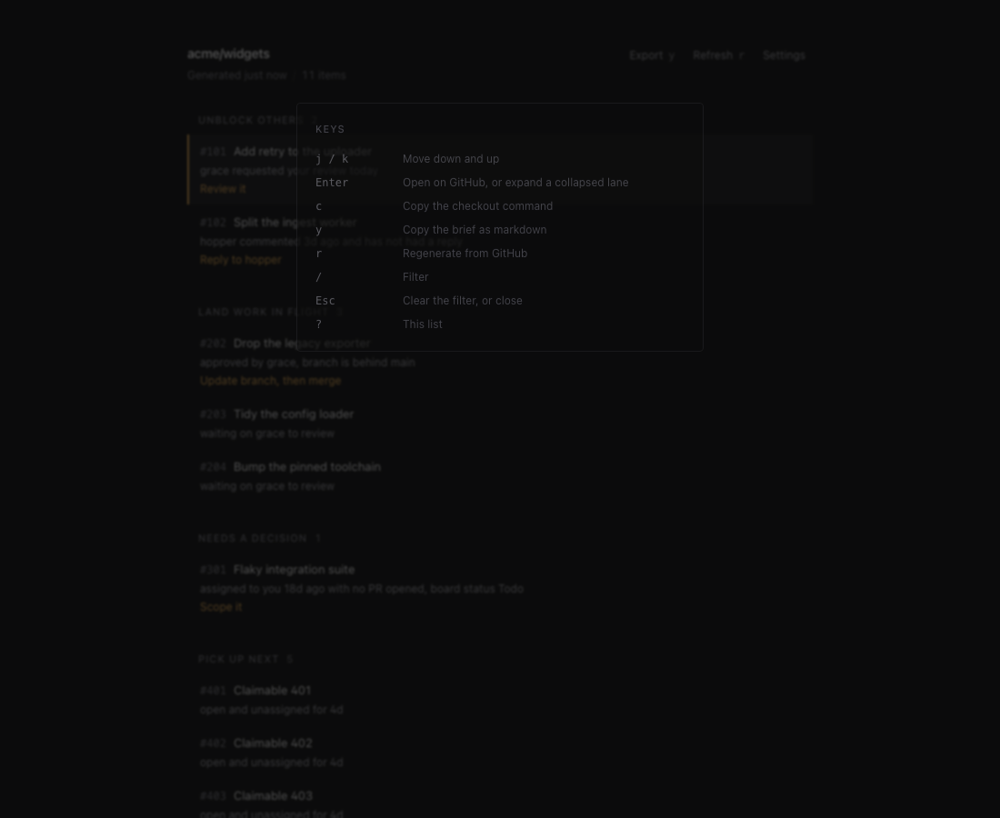

# GitHelp

A ranked daily brief of your GitHub work, generated on demand, in one page.



GitHelp answers one question: what should I do next in this repository. It queries GitHub, ranks everything you are involved in, and prints a short document. Each item gets three lines: what it is, why it is in front of you, and the next step. Items with no next step say so.

It is not an inbox. There is nothing to triage, snooze, pin, or mark as done, because the brief is regenerated rather than maintained and so cannot drift out of agreement with GitHub.

---

## Lanes

Work is sorted into four bands, rendered in the order you should work through them.

| Lane | What is in it |
| :--- | :--- |
| Unblock others | Somebody is actively waiting on you |
| Land work in flight | Your own work that is close to done |
| Needs a decision | Stalled work to revive or kill |
| Pick up next | Unassigned work you could claim |

Every item in the brief gets a row. Nothing is folded into a summary line and no lane is capped, because a page that hides rows has decided for you what is worth reading. The only thing that removes a row is a filter you typed.

Ranking is a deterministic Go function with no I/O and no model behind it. Given the same items and the same clock it always produces the same order, which means the reasoning is testable and the output is reproducible.

An action states the next step and nothing else. It never suggests closing, handing off, claiming, or abandoning work, never estimates effort, and is empty when there is nothing to do.

---

## The ball

For a pull request, the most useful fact is usually who spoke last. GitHelp merges the comment and review timelines, drops automation (`gemini-code-assist`, `github-actions`, `codecov`, anything ending in `[bot]`), and takes the last human.

If that was not you, somebody is waiting on a reply and the item moves into Unblock others, whatever its review state says. Without this a pull request where a reviewer asked a question three days ago reports "waiting on review" and sits there.

---

## Export

`y` copies the brief as markdown, ready to paste into a coding agent. Every item carries its link and, where one exists, the command to check it out, so the agent does not have to ask a follow-up question before starting.

The export is what is on screen. It respects the active filter and says so when it is showing a subset, because an agent handed a silently truncated list will confidently work on the wrong thing. With no filter it contains every row.

---

## One request

The page issues a single `GET /api/brief` on load. Filtering, grouping, and exporting are all local operations on that one payload, so typing in the filter box costs nothing.

Only two things go back to the network: pressing `r`, and switching repository. This is covered by an end-to-end test that counts requests.

---

## Keys

| Key | Action |
| :--- | :--- |
| `j` / `k` | Move down and up |
| `Enter` | Open on GitHub |
| `c` | Copy the checkout command |
| `y` | Copy the brief as markdown |
| `r` | Regenerate from GitHub |
| `/` | Filter |
| `Esc` | Clear the filter, or close |
| `?` | Key reference |

| Filtering (`/`) | Key reference (`?`) |
| :---: | :---: |
|  |  |

The interface follows your operating system for light and dark. There is no toggle.

---

## Quick start

```bash
make run
```

Open http://127.0.0.1:8080. Authentication uses your existing `gh` CLI credentials, or a personal access token set in the settings sheet.

Development mode runs Vite with hot reload on http://localhost:5173 against the backend on port 8080.

```bash
make dev
```

---

## Build and test

```bash
make build          # Standalone binary at ./bin/githelp
make test           # Go, Vitest, and Playwright
make lint           # go vet and tsc --noEmit
```

```bash
./bazel build //...
./bazel test //...
```

---

## Architecture

The server holds no copy of GitHub. It fetches, ranks, and answers.

```
auth.Manager.GetToken
  -> github.Client.FetchBriefInputs   one GraphQL request, six searches
  -> rank.Rank                        pure, clock-injected, no I/O
  -> GET /api/brief                   30s cache, ETag
```

- Backend: Go, `net/http`, `modernc.org/sqlite` in WAL mode. SQLite stores one table: your settings.
- Frontend: React 19, TypeScript, Tailwind.
- Distribution: a single executable with the assets embedded.

---

## License

[MIT](LICENSE)
